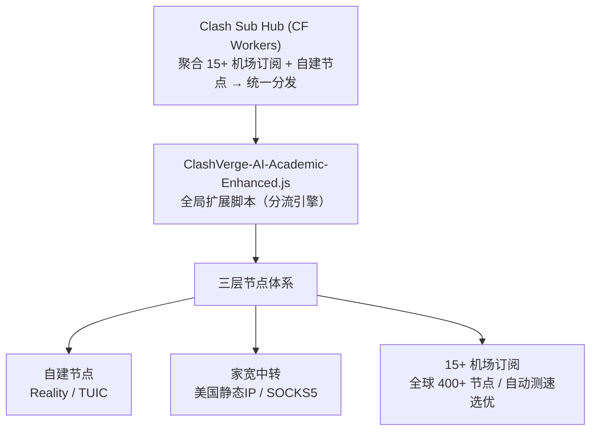

# Clash Sub Hub

基于 Cloudflare Workers 的 Clash/Mihomo 订阅聚合分发平台 + 面向学术科研与 AI 开发者的高级分流脚本。

---

## 项目组成

| 组件 | 说明 |
|------|------|
| **Clash Sub Hub** | Cloudflare Workers 订阅聚合服务，支持多用户 token、上游缓存、管理后台 |
| **ClashVerge-AI-Academic-Enhanced.js** | Clash Verge / Mihomo 全局扩展脚本，专为学术科研 + AI 场景深度优化 |

---

## 整体架构：多层冗余翻墙体系



### 为什么需要三层？

| 层级 | 节点类型 | 用途 | 优势 |
|------|---------|------|------|
| **第一层** | 自建 Reality / TUIC | 日常浏览、敏感业务 | 完全自控、IP 固定、协议最新、不共享 |
| **第二层** | 美国家宽静态 IP | AI 服务专用链路 | 住宅 IP 不触发风控、链式中转双重隔离 |
| **第三层** | 15+ 机场订阅 | 大流量、备用、测速选优 | 节点多、覆盖广、自动 fallback |

### Fallback 容灾逻辑

```
「优先自建」分组 (fallback 模式)
    │
    ├── 🛠 自建-Reality     ← 首选：自控 VPS + VLESS Reality 协议
    │       │ 不可用时 ↓
    ├── 🛠 自建-TUIC        ← 次选：同一 VPS 的 TUIC (UDP) 协议
    │       │ 不可用时 ↓
    └── ⚡️ 自动选择         ← 兜底：从全部机场节点中自动测速选最快
```

当自建节点宕机时，脚本自动在 300 秒内检测并切换到机场节点，用户无感知。当自建节点恢复后，自动切回。

### AI 专用链路：家宽链式中转

```
本机 → 机场节点(家宽中转组) → 美国家宽静态 IP → AI 服务
          ↑ 排除 CF 系节点               ↑ 住宅 IP
          ↑ 避免 CDN 回环               ↑ 不触发 OpenAI/Claude 风控
```

**为什么 AI 需要独立链路？**

- OpenAI、Claude、Gemini 等对数据中心 IP 和共享代理 IP 有严格风控
- 普通机场节点的 IP 被大量用户共享，容易触发验证码甚至封号
- 美国家宽静态 IP 是住宅级别，和真实美国用户无异，风控概率极低
- 链式中转（机场 → 家宽）确保即使机场 IP 被标记，最终出口仍是干净的家宽 IP
- 「家宽中转」分组自动排除 BPB、cfnew、Edge 等 Cloudflare 系机场节点，避免 CF→CF 回环导致 timeout

---

## ClashVerge-AI-Academic-Enhanced.js 脚本详解

### 一、节点管理：additional-prefix 前缀隔离

```
机场A 的节点: "机场A | 🇺🇸 美国 01"
机场B 的节点: "机场B | 🇺🇸 美国 01"
```

15+ 个机场订阅合在一起，不同机场可能有同名节点。脚本自动为每个上游添加 `机场名 | ` 前缀，彻底消除命名冲突。导入新机场时零配置，即用即走。

### 二、性能优化

#### 网络层加速

| 配置项 | 值 | 作用 |
|--------|-----|------|
| `unified-delay` | `true` | 统一延迟计算，测速结果更准确，选出真正最快的节点 |
| `tcp-concurrent` | `true` | TCP 并发连接，同时向多个 IP 发起连接，选最快的那个 |
| `tcp-fast-open` | `true` | TCP Fast Open，减少握手延迟，建连更快 |
| `find-process-mode` | `strict` | 精确进程匹配，确保进程级分流规则准确命中 |

#### 内存优化

| 配置项 | 值 | 作用 |
|--------|-----|------|
| `geodata-loader` | `memconservative` | 内存保守模式加载 GeoIP/GeoSite 数据，内存占用大幅降低 |
| `geosite-matcher` | `succinct` | 精简匹配算法，在保持准确性的同时减少内存和 CPU 消耗 |

#### TUN 模式精调

```javascript
config.tun = {
  enable: true,
  stack: "system",           // system 模式兼容性最佳
  "strict-route": true,     // 防止 mDNSResponder 等进程绕过 TUN 导致 DNS 泄露
  "dns-hijack": ["any:53", "tcp://any:53"],  // 劫持所有 DNS 查询，无遗漏
  "exclude-route": ["10.0.0.0/8"],           // 排除内网网段，SSH/局域网正常通信
  mtu: 1400                  // 降低 MTU，修复微信图片等大文件发送失败
};
```

**为什么 MTU 设为 1400？** 默认 1500 在 VPN 隧道中会因为额外封装导致 IP 分片，微信发送图片、大文件上传等场景出现丢包。1400 预留了足够的封装空间，避免分片。

**为什么 stack 用 system 而不是 gvisor？** gvisor 用户态网络栈虽然性能好，但和部分网站、游戏的兼容性有问题。system 模式使用系统原生网络栈，兼容性最强。

**为什么要 exclude-route 10.0.0.0/8？** 如果不排除，内网 SSH、SMB、打印机等流量都会被 TUN 劫持，导致局域网通信中断。

### 三、DNS 安全与性能

```
                      ┌─────────────────────────┐
                      │     DNS 查询分流策略      │
                      └────────────┬────────────┘
                                   │
                 ┌─────────────────┼─────────────────┐
                 │                 │                  │
           国内域名           海外/AI域名          学术期刊
         ↓                    ↓                    ↓
    阿里/腾讯 DoH        自建 DoH 服务器        国内 DNS
   (223.5.5.5)        (doh.guoyingwei.top)    (机构IP直连)
                              │
                        ↓ 备用 ↓
                   Cloudflare 1.1.1.1
                   Google 8.8.8.8
                   Quad9 dns.quad9.net
```

#### DNS 分流细节

| 域名类型 | DNS 服务器 | 原因 |
|----------|-----------|------|
| 国内域名 (`geosite:cn`) | 阿里 + 腾讯 DoH | 国内解析速度最快，返回最优 CDN IP |
| 海外/AI 域名 | 自建 DoH → CF/Google/Quad9 | 自建 DoH 防污染，多备用保证可用性 |
| 学术期刊 (nature.com 等) | 国内 DNS | 确保返回国内 CDN IP，走机构网络直连下载全文 |
| 节点服务器地址 | 国内 DNS | 防止节点域名解析走代理形成死循环 |

#### fake-ip 过滤列表

AI 服务域名 (`openai.com`、`chatgpt.com`、`auth0.com`) 被加入 fake-ip-filter，使用真实 IP 而非 fake-ip 地址。原因：

- AI 服务的 WebSocket 连接和 SSE 流式响应依赖真实 IP
- fake-ip 可能导致 AI 服务的认证流程 (auth0) 异常
- Google OAuth 相关域名也被排除，确保登录流程正常

微信相关域名全部排除 fake-ip，避免消息发送、语音通话、小程序等功能异常。

### 四、分流规则体系

#### 规则来源

| 来源 | 规则集 | 更新频率 |
|------|--------|---------|
| **Loyalsoldier** | reject, proxy, direct, private, gfw, tld-not-cn, cncidr, lancidr, telegramcidr, applications, apple | 24h 自动同步 |
| **Blackmatrix7** | Google, Microsoft, YouTube, Twitter, TikTok, OpenAI | 24h 自动同步 |
| **自定义域名** | AI 全家桶、学术期刊、特殊域名 | 跟随脚本更新 |

#### 规则优先级

```
1. 自定义域名后缀规则 (DOMAIN-SUFFIX)     ← 最高优先级，精准命中
2. AI 进程规则 (PROCESS-NAME)             ← Claude、Cursor、ChatGPT 等客户端
3. 即时通讯直连 (PROCESS-NAME)            ← 微信、OneDrive 强制直连
4. 学术工具直连 (PROCESS-NAME)            ← Zotero、EndNote 走机构网络
5. 第三方规则集 (RULE-SET)                ← Loyalsoldier + Blackmatrix7
6. GeoSite/GeoIP 兜底                     ← CN 直连
7. MATCH 漏网之鱼                          ← 未匹配的走自动选择
```

#### QUIC 拦截

```javascript
"AND,((NETWORK,UDP),(DST-PORT,443)),REJECT"
```

拦截 UDP 443 端口（QUIC/HTTP3）流量。原因：QUIC 走 UDP 且加密，代理软件无法有效分流和缓存，强制回退到 TCP HTTPS 可以获得更好的分流效果和更稳定的连接。

### 五、学术科研专项优化

#### 期刊域名直连列表

脚本内置 30+ 主流学术数据库和期刊出版商的域名，全部走直连：

| 类别 | 覆盖的平台 |
|------|-----------|
| **综合数据库** | Web of Science, Scopus, Google Scholar |
| **期刊出版商** | Nature, Science, Elsevier (ScienceDirect), Springer, Wiley, IEEE, ACM, JSTOR, SAGE, Taylor & Francis, MDPI, ACS, RSC, PLOS, Cell, PNAS |
| **预印本** | arXiv, bioRxiv, medRxiv |
| **学术社区** | ResearchGate, Semantic Scholar |
| **文献标识** | DOI.org, CrossRef, Unpaywall |
| **中文数据库** | CNKI (知网), 万方, 维普 |

**为什么学术网站要直连？** 大学/研究机构的 IP 地址段被学术数据库列入白名单，可以免费下载全文 PDF。如果走代理，出口 IP 不在机构 IP 段内，会被要求付费购买。

#### 学术工具进程识别

```javascript
"PROCESS-NAME,zotero,全局直连",       // Zotero 文献管理
"PROCESS-NAME,zotero.exe,全局直连",
"PROCESS-NAME,EndNote,全局直连",      // EndNote 文献管理
"PROCESS-NAME,EndNote.exe,全局直连",
```

Zotero 和 EndNote 的网络请求（自动下载 PDF、同步文献库、抓取元数据）强制直连。确保文献管理工具使用机构 IP 访问数据库，自动下载全文不受阻。

#### 学术期刊 DNS 策略

```javascript
"+.nature.com,+.sciencedirect.com,+.springer.com,+.ieee.org,+.wiley.com,+.arxiv.org": domesticNameservers
```

学术期刊域名的 DNS 查询走国内 DNS 服务器。原因：这些域名有国内 CDN 节点，国内 DNS 会返回最近的 CDN IP，直连速度更快。

### 六、AI 服务深度优化

#### AI 域名全覆盖

脚本内置的 AI 域名列表覆盖所有主流 AI 平台：

| 平台 | 覆盖域名 |
|------|---------|
| **OpenAI** | openai.com, chatgpt.com, oaistatic.com, oaiusercontent.com |
| **Anthropic** | anthropic.com, claude.com, claude.ai, clau.de, claudeusercontent.com |
| **Google** | gemini.google.com, gemini.googleapis.com, generativelanguage.googleapis.com, generativeai.google, ai.google.dev |
| **xAI** | x.ai, grok.com |
| **其他** | perplexity.ai, duckduckgo.com, minimaxi.com, minimax.chat |

#### AI 客户端进程识别

```javascript
"PROCESS-NAME,Claude.exe,AI",
"PROCESS-NAME,claude,AI",
"PROCESS-NAME,Claude Helper,AI",
"PROCESS-NAME,Cursor.exe,AI",
"PROCESS-NAME,cursor,AI",
"PROCESS-NAME,ChatGPT.exe,AI",
"PROCESS-NAME,ChatGPT,AI",
"PROCESS-NAME,ChatGPTHelper,AI",
```

Claude 桌面版、Cursor 编辑器、ChatGPT 桌面版——所有 AI 客户端进程直接走 AI 分组，无需依赖域名规则，即使客户端使用了非标准域名也能准确分流。

#### AI 分组的特殊排列

```javascript
{ name: "AI",
  proxies: ["🏠 家宽", "优先自建", "⚡️ 自动选择", "节点选择"] }
```

AI 分组的默认顺序：**家宽优先**。美国家宽静态 IP 是住宅级别，对 AI 服务风控最友好。家宽不可用时 fallback 到自建节点，再到机场。

### 七、动态适配：零配置自适应

脚本在运行时动态检测 Merge 配置中注入的节点：

```javascript
const hasSelfBuilt = config.proxies.some(p => p.name === "🛠 自建-Reality");
const hasISP = config.proxies.some(p => p.name === "🏠 家宽-ISP");
const hasTUIC = config.proxies.some(p => p.name === "🛠 自建-TUIC");
```

| 场景 | 行为 |
|------|------|
| 有自建 + 有家宽 | 完整模式：优先自建 fallback、家宽组、家宽中转组全部创建 |
| 有自建 + 无家宽 | 精简模式：隐藏家宽相关分组，AI 直接走自建/机场 |
| 无自建 + 无家宽 | 纯机场模式：优先自建退化为自动选择，所有流量走机场节点 |

同一份脚本适配所有配置组合，Merge 里加减节点后脚本自动调整，不用改一行代码。

### 八、安全解耦设计

```
┌──────────────────────┐     ┌──────────────────────────┐
│   Script (脚本)       │     │   Merge (覆写配置)         │
│                      │     │                          │
│ ✅ 分流规则           │     │ 🔒 proxy-providers       │
│ ✅ DNS 配置           │     │    (机场订阅链接)          │
│ ✅ 代理分组逻辑       │     │ 🔒 proxies               │
│ ✅ 性能参数           │     │    (自建节点 uuid/密码)    │
│                      │     │                          │
│ → 可安全开源 ✅       │     │ → 严格保密 🔒            │
└──────────────────────┘     └──────────────────────────┘
```

脚本完全不含任何敏感信息（订阅 URL、节点 IP、UUID、密码等），全部通过 Merge 配置在本地注入。脚本可以安全开源、分享、同步，不会泄露任何隐私。

---

## Clash Sub Hub 订阅聚合服务

### 功能特性

- **多用户管理**：自定义 token 创建用户，每人独立订阅链接，随时启用/禁用
- **上游订阅聚合**：支持添加多个机场订阅，定时缓存（每小时 Cron 自动刷新）
- **自建节点管理**：YAML 格式添加/编辑自建节点，支持 TCP 连通性测试
- **完整配置输出**：服务端执行扩展脚本，输出带完整分流规则的 Clash 配置
- **Base64 格式**：`?format=base64` 输出 URI 列表，兼容 Shadowrocket 等客户端
- **脚本分层管理**：基础脚本（外部链接自动同步）+ 自定义追加脚本（不被覆盖）
- **导入导出**：支持 Merge YAML 导入导出，一键迁移机场订阅和自建节点
- **管理后台**：Web UI 管理界面，CodeMirror 代码编辑器

### 技术栈

- **Runtime**: Cloudflare Workers
- **存储**: Cloudflare KV
- **定时任务**: Cron Triggers (每小时)
- **前端**: Tailwind CSS + CodeMirror 5
- **部署**: Wrangler CLI

### API 端点

| 端点 | 方法 | 说明 |
|------|------|------|
| `/sub/:token` | GET | 获取订阅配置 (`?format=base64` 切换格式) |
| `/script.js` | GET | 获取基础扩展脚本 |
| `/admin` | GET | 管理后台 |
| `/api/users` | GET/POST | 用户管理 |
| `/api/upstreams` | GET/POST | 上游订阅管理 |
| `/api/custom-nodes` | GET/POST | 自建节点管理 |
| `/api/script` | GET/POST | 脚本管理 (base + override) |
| `/api/refresh` | POST | 手动刷新所有上游 |
| `/api/import/merge` | POST | 导入 Merge YAML |
| `/api/export/merge` | GET | 导出 Merge YAML |

### 部署步骤

```bash
# 1. 克隆仓库
git clone https://github.com/guoyingwei6/clash-sub-hub.git
cd clash-sub-hub

# 2. 安装依赖
npm install

# 3. 创建 KV namespace
npx wrangler kv namespace create KV
# 将输出的 id 填入 wrangler.toml

# 4. 设置管理密码
npx wrangler secret put ADMIN_PASSWORD

# 5. 部署
npx wrangler deploy

# 6. (可选) 绑定自定义域名
# 在 Cloudflare Dashboard → Workers → 自定义域名
```

---

## Merge 配置模板

在 Clash Verge 的「全局扩展覆写配置」(Merge) 中填写：

```yaml
proxy-providers:
  机场A:
    type: http
    url: "你的机场A订阅链接"
    interval: 3600
    path: ./providers/机场A.yaml
    health-check:
      enable: true
      interval: 600
      url: https://www.gstatic.com/generate_204
    override:
      additional-prefix: "机场A | "
    header:
      User-Agent:
        - clash.meta

  机场B:
    type: http
    url: "你的机场B订阅链接"
    interval: 3600
    path: ./providers/机场B.yaml
    health-check:
      enable: true
      interval: 600
      url: https://www.gstatic.com/generate_204
    override:
      additional-prefix: "机场B | "
    header:
      User-Agent:
        - clash.meta

proxies:
  - name: "🛠 自建-Reality"
    type: vless
    server: 你的VPS_IP
    port: 443
    uuid: 你的UUID
    network: tcp
    tls: true
    udp: true
    flow: xtls-rprx-vision
    servername: www.microsoft.com
    reality-opts:
      public-key: 你的公钥
      short-id: 你的short-id

  - name: "🛠 自建-TUIC"
    type: tuic
    server: 你的VPS_IP
    port: 443
    uuid: 你的UUID
    password: 你的密码
    alpn: [h3]
    udp-relay-mode: native
    congestion-controller: bbr

  - name: "🏠 家宽-ISP"
    type: socks5
    server: 你的家宽IP
    port: 端口
    username: 用户名
    password: 密码
```

---

## 许可

MIT License
