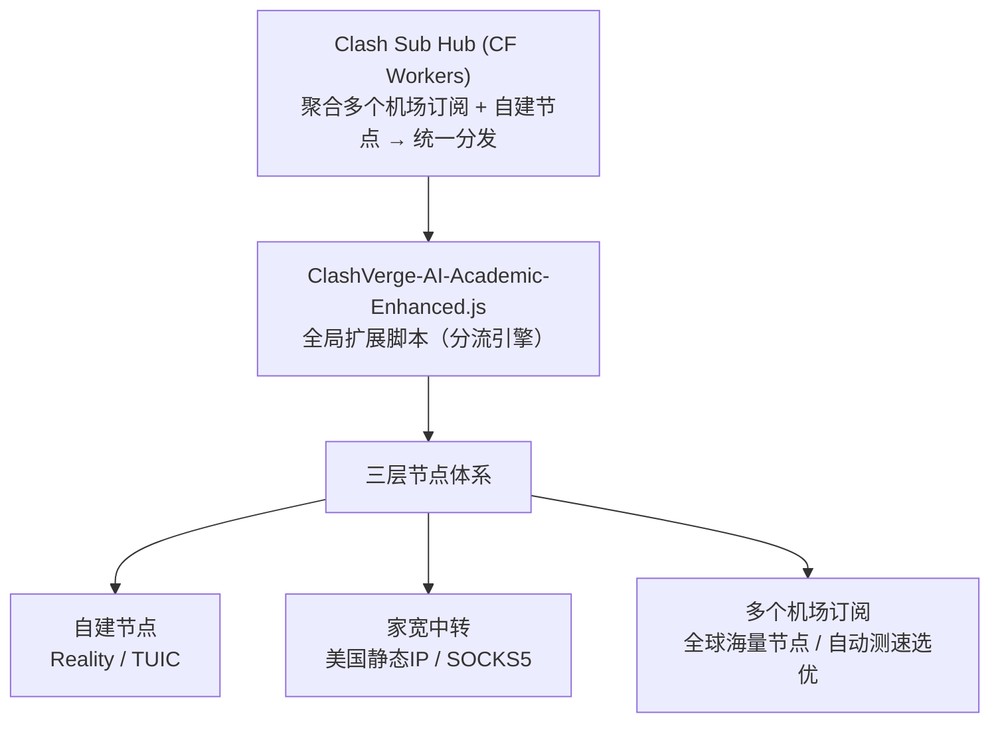

# Clash Sub Hub

基于 Cloudflare Workers 的 Clash/Mihomo 订阅聚合分发平台 + 面向学术科研与 AI 开发者的高级分流脚本。

---

## 项目组成

| 组件 | 说明 |
|------|------|
| **Clash Sub Hub** | Cloudflare Workers 订阅聚合服务，支持多用户 token、上游缓存、管理后台 |
| **ClashVerge-AI-Academic-Enhanced.js** | Clash Verge / Mihomo 全局扩展脚本，专为学术科研 + AI 场景深度优化 |

推荐使用方式：在 Clash Verge 中只导入 `/sub/:token`。Worker 直接返回包含节点、分组、规则、DNS 和 TUN 的完整 Mihomo YAML；机场和自建节点都在远端维护。

---

## 更新记录

### 2026-07-29

- `/sub/:token` 改为默认 Materialized 单链接；Provider/Merge 只有被管理员显式授权的用户才能使用。
- Merge 导入改为“预览差异 → 二次确认 → 全量替换”，支持新增、更新和删除，并保留 30 天 revision 审计快照；小时级 artifact 刷新不重复保存完整敏感快照。
- 活动配置内嵌完整 Materialized artifact，订阅请求不再逐个解析所有机场缓存，也不会读取跨 KV 键传播中的半成品。
- 恢复每小时 Cron，增加最后成功缓存、指数退避、下一次重试时间和陈旧状态；普通机场默认 optional + serve-stale。
- 增加受信任 Mirror 预载/上传协议：HMAC-SHA256、5 分钟时间窗、随机 nonce、防重放、严格节点解析和大小限制。
- 用户 token 改为 256-bit 随机值并只保存 SHA-256；支持权限、禁用、轮换和 Provider/Merge 高风险开关。
- 停止动态执行或公开 KV 脚本；`/script.js` 只返回构建时审计版本。
- 管理后台依赖改为同源构建资源，增加 CSP、输入/XSS 防护，并把登录密码换成 15 分钟 HttpOnly 签名会话；Bearer 仅保留给自动化客户端。
- 增加 TypeScript、Vitest、覆盖率、安全 fixture 和 Worker dry-run release gate。
- 增加隔离 Staging Worker/KV、脱敏 Provider Worker、精确主机白名单、强制 Mihomo smoke 和本地只读等效性审计；真实客户端导入仍需用户单独确认。
- `main` 推送只执行 release gate；生产部署必须手动触发、选择 `DEPLOY_PRODUCTION`，并经过 GitHub `production` environment 门禁。

### 2026-06-29

- 新增 `/sub/:token?mode=materialized`，由 Worker 直接输出已物化完整 Mihomo YAML，Clash Verge 可只导入一个订阅链接，不再依赖本地 Merge 覆写。
- 新增 `/merge/:token`，继续支持空 Profile Template + 全局扩展脚本 + Merge 覆写的高级用法。
- 当时恢复 Cloudflare Workers 线上部署并接入 GitHub Actions；自 2026-07-29 起，`main` 推送只做验证，生产部署改为人工门禁。
- 去掉 Cloudflare Cron Triggers，避免占用账号 Cron 配额；上游订阅和基础脚本改为管理后台手动刷新/同步。
- 重做 `/admin` 管理后台 UI：新增侧边导航、顶部操作栏、统计摘要、统一按钮/状态标签/表格/弹窗样式，并适配移动端。

---

## 整体架构：多层冗余翻墙体系


```mermaid
graph TD
    A["Clash Sub Hub (CF Workers)<br/>聚合多个机场订阅 + 自建节点 → 统一分发"] --> B
    B["ClashVerge-AI-Academic-Enhanced.js<br/>全局扩展脚本（分流引擎）"] --> C
    C["三层节点体系"] --> D["自建节点<br/>Reality / TUIC"]
    C --> E["家宽中转<br/>美国静态IP / SOCKS5"]
    C --> F["多个机场订阅<br/>全球海量节点 / 自动测速选优"]
```

### 为什么需要三层？

| 层级 | 节点类型 | 用途 | 优势 |
|------|---------|------|------|
| **第一层** | 自建 Reality / TUIC | 日常浏览、敏感业务 | 完全自控、IP 固定、协议最新、不共享 |
| **第二层** | 美国家宽静态 IP | AI 服务专用链路 | 住宅 IP 不触发风控、链式中转双重隔离 |
| **第三层** | 多个机场订阅 | 大流量、备用、测速选优 | 节点多、覆盖广、自动 fallback |

### Fallback 容灾逻辑

```
「优先自建」分组 (fallback 模式)
    │
    ├── 🛠 自建-Reality     ← 首选：自控 VPS + VLESS Reality 协议
    │       │ 不可用时 ↓
    ├── 🛠 自建-TUIC        ← 次选：同一 VPS 的 TUIC (UDP) 协议
    │       │ 不可用时 ↓
    └── ⚡️ 自动选择         ← 兜底：从全部机场节点中自动测速选最快
```

当自建节点宕机时，脚本自动在 300 秒内检测并切换到机场节点，用户无感知。当自建节点恢复后，自动切回。

### AI 专用链路：家宽链式中转

```
本机 → 机场节点(家宽中转组) → 美国家宽静态 IP → AI 服务
          ↑ 排除 CF 系节点               ↑ 住宅 IP
          ↑ 避免 CDN 回环               ↑ 不触发 OpenAI/Claude 风控
```

**为什么 AI 需要独立链路？**

- OpenAI、Claude、Gemini 等对数据中心 IP 和共享代理 IP 有严格风控
- 普通机场节点的 IP 被大量用户共享，容易触发验证码甚至封号
- 美国家宽静态 IP 是住宅级别，和真实美国用户无异，风控概率极低
- 链式中转（机场 → 家宽）确保即使机场 IP 被标记，最终出口仍是干净的家宽 IP
- 「家宽中转」分组自动排除 BPB、cfnew、Edge 等 Cloudflare 系机场节点，避免 CF→CF 回环导致 timeout

---

## ClashVerge-AI-Academic-Enhanced.js 脚本详解

### 一、节点管理：additional-prefix 前缀隔离

```
机场A 的节点: "机场A | 🇺🇸 美国 01"
机场B 的节点: "机场B | 🇺🇸 美国 01"
```

多个机场订阅合在一起，不同机场可能有同名节点。脚本自动为每个上游添加 `机场名 | ` 前缀，彻底消除命名冲突。导入新机场时零配置，即用即走。

### 二、性能优化

#### 网络层加速

| 配置项 | 值 | 作用 |
|--------|-----|------|
| `unified-delay` | `true` | 统一延迟计算，测速结果更准确，选出真正最快的节点 |
| `tcp-concurrent` | `true` | TCP 并发连接，同时向多个 IP 发起连接，选最快的那个 |
| `tcp-fast-open` | `true` | TCP Fast Open，减少握手延迟，建连更快 |
| `find-process-mode` | `strict` | 精确进程匹配，确保进程级分流规则准确命中 |

#### 内存优化

| 配置项 | 值 | 作用 |
|--------|-----|------|
| `geodata-loader` | `memconservative` | 内存保守模式加载 GeoIP/GeoSite 数据，内存占用大幅降低 |
| `geosite-matcher` | `succinct` | 精简匹配算法，在保持准确性的同时减少内存和 CPU 消耗 |

#### TUN 模式精调

```javascript
config.tun = {
  enable: true,
  stack: "system",           // system 模式兼容性最佳
  "strict-route": true,     // 防止 mDNSResponder 等进程绕过 TUN 导致 DNS 泄露
  "dns-hijack": ["any:53", "tcp://any:53"],  // 劫持所有 DNS 查询，无遗漏
  "exclude-route": ["10.0.0.0/8"],           // 排除内网网段，SSH/局域网正常通信
  mtu: 1400                  // 降低 MTU，修复微信图片等大文件发送失败
};
```

**为什么 MTU 设为 1400？** 默认 1500 在 VPN 隧道中会因为额外封装导致 IP 分片，微信发送图片、大文件上传等场景出现丢包。1400 预留了足够的封装空间，避免分片。

**为什么 stack 用 system 而不是 gvisor？** gvisor 用户态网络栈虽然性能好，但和部分网站、游戏的兼容性有问题。system 模式使用系统原生网络栈，兼容性最强。

**为什么要 exclude-route 10.0.0.0/8？** 如果不排除，内网 SSH、SMB、打印机等流量都会被 TUN 劫持，导致局域网通信中断。

### 三、DNS 安全与性能

```
                      ┌─────────────────────────┐
                      │     DNS 查询分流策略      │
                      └────────────┬────────────┘
                                   │
                 ┌─────────────────┼─────────────────┐
                 │                 │                  │
           国内域名           海外/AI域名          学术期刊
         ↓                    ↓                    ↓
    阿里/腾讯 DoH        自建 DoH 服务器        国内 DNS
   (223.5.5.5)        (doh.guoyingwei.top)    (机构IP直连)
                              │
                        ↓ 备用 ↓
                   Cloudflare 1.1.1.1
                   Google 8.8.8.8
                   Quad9 dns.quad9.net
```

#### DNS 分流细节

| 域名类型 | DNS 服务器 | 原因 |
|----------|-----------|------|
| 国内域名 (`geosite:cn`) | 阿里 + 腾讯 DoH | 国内解析速度最快，返回最优 CDN IP |
| 海外/AI 域名 | 自建 DoH → CF/Google/Quad9 | 自建 DoH 防污染，多备用保证可用性 |
| 学术期刊 (nature.com 等) | 国内 DNS | 确保返回国内 CDN IP，走机构网络直连下载全文 |
| 节点服务器地址 | 国内 DNS | 防止节点域名解析走代理形成死循环 |

#### fake-ip 过滤列表

AI 服务域名 (`openai.com`、`chatgpt.com`、`auth0.com`) 被加入 fake-ip-filter，使用真实 IP 而非 fake-ip 地址。原因：

- AI 服务的 WebSocket 连接和 SSE 流式响应依赖真实 IP
- fake-ip 可能导致 AI 服务的认证流程 (auth0) 异常
- Google OAuth 相关域名也被排除，确保登录流程正常

微信相关域名全部排除 fake-ip，避免消息发送、语音通话、小程序等功能异常。

### 四、分流规则体系

#### 规则来源

| 来源 | 规则集 | 更新频率 |
|------|--------|---------|
| **Loyalsoldier** | reject, proxy, direct, private, gfw, tld-not-cn, cncidr, lancidr, telegramcidr, applications, apple | 24h 自动同步 |
| **Blackmatrix7** | Google, Microsoft, YouTube, Twitter, TikTok, OpenAI | 24h 自动同步 |
| **自定义域名** | AI 全家桶、学术期刊、特殊域名 | 跟随脚本更新 |

#### 规则优先级

```
1. 自定义域名后缀规则 (DOMAIN-SUFFIX)     ← 最高优先级，精准命中
2. AI 进程规则 (PROCESS-NAME)             ← Claude、Cursor、ChatGPT 等客户端
3. 即时通讯直连 (PROCESS-NAME)            ← 微信、OneDrive 强制直连
4. 学术工具直连 (PROCESS-NAME)            ← Zotero、EndNote 走机构网络
5. 第三方规则集 (RULE-SET)                ← Loyalsoldier + Blackmatrix7
6. GeoSite/GeoIP 兜底                     ← CN 直连
7. MATCH 漏网之鱼                          ← 未匹配的走自动选择
```

#### QUIC 拦截

```javascript
"AND,((NETWORK,UDP),(DST-PORT,443)),REJECT"
```

拦截 UDP 443 端口（QUIC/HTTP3）流量。原因：QUIC 走 UDP 且加密，代理软件无法有效分流和缓存，强制回退到 TCP HTTPS 可以获得更好的分流效果和更稳定的连接。

### 五、学术科研专项优化

#### 期刊域名直连列表

脚本内置 30+ 主流学术数据库和期刊出版商的域名，全部走直连：

| 类别 | 覆盖的平台 |
|------|-----------|
| **综合数据库** | Web of Science, Scopus, Google Scholar |
| **期刊出版商** | Nature, Science, Elsevier (ScienceDirect), Springer, Wiley, IEEE, ACM, JSTOR, SAGE, Taylor & Francis, MDPI, ACS, RSC, PLOS, Cell, PNAS |
| **预印本** | arXiv, bioRxiv, medRxiv |
| **学术社区** | ResearchGate, Semantic Scholar |
| **文献标识** | DOI.org, CrossRef, Unpaywall |
| **中文数据库** | CNKI (知网), 万方, 维普 |

**为什么学术网站要直连？** 大学/研究机构的 IP 地址段被学术数据库列入白名单，可以免费下载全文 PDF。如果走代理，出口 IP 不在机构 IP 段内，会被要求付费购买。

#### 学术工具进程识别

```javascript
"PROCESS-NAME,zotero,全局直连",       // Zotero 文献管理
"PROCESS-NAME,zotero.exe,全局直连",
"PROCESS-NAME,EndNote,全局直连",      // EndNote 文献管理
"PROCESS-NAME,EndNote.exe,全局直连",
```

Zotero 和 EndNote 的网络请求（自动下载 PDF、同步文献库、抓取元数据）强制直连。确保文献管理工具使用机构 IP 访问数据库，自动下载全文不受阻。

#### 学术期刊 DNS 策略

```javascript
"+.nature.com,+.sciencedirect.com,+.springer.com,+.ieee.org,+.wiley.com,+.arxiv.org": domesticNameservers
```

学术期刊域名的 DNS 查询走国内 DNS 服务器。原因：这些域名有国内 CDN 节点，国内 DNS 会返回最近的 CDN IP，直连速度更快。

### 六、AI 服务深度优化

#### AI 域名全覆盖

脚本内置的 AI 域名列表覆盖所有主流 AI 平台：

| 平台 | 覆盖域名 |
|------|---------|
| **OpenAI** | openai.com, chatgpt.com, oaistatic.com, oaiusercontent.com |
| **Anthropic** | anthropic.com, claude.com, claude.ai, clau.de, claudeusercontent.com |
| **Google** | gemini.google.com, gemini.googleapis.com, generativelanguage.googleapis.com, generativeai.google, ai.google.dev |
| **xAI** | x.ai, grok.com |
| **其他** | perplexity.ai, duckduckgo.com, minimaxi.com, minimax.chat |

#### AI 客户端进程识别

```javascript
"PROCESS-NAME,Claude.exe,AI",
"PROCESS-NAME,claude,AI",
"PROCESS-NAME,Claude Helper,AI",
"PROCESS-NAME,Cursor.exe,AI",
"PROCESS-NAME,cursor,AI",
"PROCESS-NAME,ChatGPT.exe,AI",
"PROCESS-NAME,ChatGPT,AI",
"PROCESS-NAME,ChatGPTHelper,AI",
```

Claude 桌面版、Cursor 编辑器、ChatGPT 桌面版——所有 AI 客户端进程直接走 AI 分组，无需依赖域名规则，即使客户端使用了非标准域名也能准确分流。

#### AI 分组的特殊排列

```javascript
{ name: "AI",
  proxies: ["🏠 家宽", "优先自建", "⚡️ 自动选择", "节点选择"] }
```

AI 分组的默认顺序：**家宽优先**。美国家宽静态 IP 是住宅级别，对 AI 服务风控最友好。家宽不可用时 fallback 到自建节点，再到机场。

### 七、动态适配：零配置自适应

脚本在运行时动态检测 Merge 配置中注入的节点：

```javascript
const hasSelfBuilt = config.proxies.some(p => p.name === "🛠 自建-Reality");
const hasISP = config.proxies.some(p => p.name === "🏠 家宽-ISP");
const hasTUIC = config.proxies.some(p => p.name === "🛠 自建-TUIC");
```

| 场景 | 行为 |
|------|------|
| 有自建 + 有家宽 | 完整模式：优先自建 fallback、家宽组、家宽中转组全部创建 |
| 有自建 + 无家宽 | 精简模式：隐藏家宽相关分组，AI 直接走自建/机场 |
| 无自建 + 无家宽 | 纯机场模式：优先自建退化为自动选择，所有流量走机场节点 |

同一份脚本适配所有配置组合，Merge 里加减节点后脚本自动调整，不用改一行代码。

### 八、安全解耦设计

```
┌──────────────────────┐     ┌──────────────────────────┐
│   Script (脚本)       │     │   Merge (覆写配置)         │
│                      │     │                          │
│ ✅ 分流规则           │     │ 🔒 proxy-providers       │
│ ✅ DNS 配置           │     │    (机场订阅链接)          │
│ ✅ 代理分组逻辑       │     │ 🔒 proxies               │
│ ✅ 性能参数           │     │    (自建节点 uuid/密码)    │
│                      │     │                          │
│ → 可安全开源 ✅       │     │ → 严格保密 🔒            │
└──────────────────────┘     └──────────────────────────┘
```

脚本完全不含任何敏感信息（订阅 URL、节点 IP、UUID、密码等），全部通过 Merge 配置在本地注入。脚本可以安全开源、分享、同步，不会泄露任何隐私。

---

## Clash Sub Hub 订阅聚合服务

### 功能特性

- **多用户管理**：服务端生成高熵 token；每个分享对象可独立授权、禁用和轮换
- **上游订阅聚合**：支持 `server`、`mirror`、`disabled` 三种抓取模式和最后成功缓存
- **自建节点管理**：YAML 格式添加/编辑自建节点，支持 TCP 连通性测试
- **完整配置输出**：活动配置内嵌确定性 artifact，输出节点、分组、规则、DNS 和 TUN
- **Base64 格式**：`?format=base64` 输出 URI 列表，兼容 Shadowrocket 等客户端
- **全量同步**：Merge YAML 先预览差异，再显式 replace；失败不切换活动配置
- **安全构建**：Materialized 只执行编译进 Worker 的生成器，不执行 KV 中的任意 JavaScript
- **管理后台**：同源 Tailwind/CodeMirror 资源、CSP、15 分钟 HttpOnly/SameSite 签名会话；长期管理员密码不进入浏览器存储

### 技术栈

- **Runtime**: Cloudflare Workers
- **存储**: Cloudflare KV
- **前端**: Tailwind CSS + CodeMirror 5
- **部署**: GitHub Actions + Wrangler CLI

### API 端点

| 端点 | 方法 | 说明 |
|------|------|------|
| `/sub/:token` | GET | 默认获取已物化完整 Mihomo YAML；推荐分享链接 |
| `/sub/:token?mode=provider` | GET | 高风险降级模式；仅显式授权用户可用，会暴露原始上游 URL |
| `/sub/:token?mode=nodes` | GET | 获取已物化纯节点 YAML |
| `/sub/:token?format=base64` | GET | 获取已物化 URI Base64 订阅 |
| `/merge/:token` | GET | 高风险 Legacy Merge；仅显式授权用户可用 |
| `/script.js` | GET | 获取构建时审计的 Legacy 扩展脚本 |
| `/mirror/:upstreamId` | POST | HMAC 鉴权的活动 Mirror 缓存上传 |
| `/mirror-stage/:upstreamId` | POST | 配置激活前的 HMAC Mirror 预载 |
| `/admin` | GET | 管理后台 |
| `/api/admin/session` | GET/POST/DELETE | 检查、创建或清除短期管理会话 |
| `/api/users` | GET/POST | 用户管理 |
| `/api/upstreams` | GET/POST | 上游订阅管理 |
| `/api/custom-nodes` | GET/POST | 自建节点管理 |
| `/api/script` | GET | 查看构建时脚本状态；运行时写入返回 410 |
| `/api/refresh` | POST | 手动刷新所有上游 |
| `/api/import/merge` | POST | 预览或 replace 应用 Merge YAML |
| `/api/export/merge` | GET | 导出 Merge YAML |

### 输出模式

- **Materialized（默认）**：`/sub/:token` 返回完整 YAML，不包含原始机场订阅 URL，Clash Verge 不再需要本地 Merge/Script。
- **纯节点**：`?mode=nodes` 或 `?format=base64`，用于只需要节点的客户端。
- **Provider/Merge（显式降级）**：会把机场订阅 URL 交给接收者，因此新用户默认禁止；只可对完全受信任对象开启。

分享边界：Materialized 会隐藏原始机场订阅 URL，但接收者必然可以读取最终节点连接参数。每个分享对象应使用独立 token，便于单独吊销和轮换。

### 部署步骤

```bash
# 1. 克隆仓库
git clone https://github.com/guoyingwei6/clash-sub-hub.git
cd clash-sub-hub

# 2. 安装依赖
npm install

# 3. 创建 KV namespace
npx wrangler kv namespace create KV
# 将输出的 id 填入 wrangler.toml

# 4. 设置 Worker secrets
npx wrangler secret put ADMIN_PASSWORD
npx wrangler secret put MIRROR_UPLOAD_SECRET

# 5. 运行完整 release gate
npm run check

# 6. 部署
npx wrangler deploy

# 7. GitHub Actions 验证与人工生产部署
# 设置 GitHub Secrets:
# CLOUDFLARE_ACCOUNT_ID、CLOUDFLARE_API_TOKEN、
# ADMIN_PASSWORD、MIRROR_UPLOAD_SECRET
# 推送到 main 后只运行 release gate。
# 生产部署需在 Actions 手动运行 Deploy Worker，
# 并选择 DEPLOY_PRODUCTION；建议为 production environment 配置审批人。

# 8. (可选) 绑定自定义域名
# 在 Cloudflare Dashboard → Workers → 自定义域名
```

### 隔离 Staging 验证

Staging 使用独立 Worker、独立 KV 和纯 TEST-NET fixture，不应指向生产 KV。完整 smoke 会先验证服务端返回 `deploymentEnvironment=staging`，然后才允许写入测试 KV。

```bash
npm run staging:dry-run
npm run staging:provider:dry-run

# 部署仅限隔离 Staging
npm run staging:provider:deploy
npm run staging:deploy

# ADMIN_PASSWORD 与 MIRROR_UPLOAD_SECRET 应由当前受保护 shell/secret store 注入
CLASH_SUB_HUB_URL="https://clash-sub-hub-staging.guoyingwei6.workers.dev" \
STAGING_PROVIDER_URL="https://clash-sub-hub-staging-provider.guoyingwei6.workers.dev/provider.yaml" \
MIHOMO_BIN="/absolute/path/to/mihomo" \
npm run staging:smoke
```

Smoke 固定只接受仓库中登记的这两个精确主机；fork 或重建 Staging 时，应先在代码评审中更新白名单，不能用命令行临时绕过。

对本机真实 Clash Verge 状态只做内存比较：

```bash
npm run audit:local-equivalence
```

该审计只输出计数和布尔结果，不打印订阅源、token、节点名称或凭据，也不会写 Clash Verge 配置。导入/切换订阅、修改客户端、重启 Clash、切换系统代理或 TUN 都不属于上述命令；这些动作必须另行得到用户明确授权。

详细验证结果见 `docs/reports/2026-07-29-staging-validation.md`。

### 受信任 Mirror 生产者

当 Cloudflare 无法直接抓取某个机场时，在导出的 Merge 中将该 Provider 标为：

```yaml
x-clash-sub-hub-fetch-mode: mirror
```

把该上游的 `UpstreamDefinition` JSON 保存在受信任 VPS 的仓库外路径，然后定时运行：

由 systemd/cron 的受限环境文件或 secret manager 注入
`CLASH_SUB_HUB_URL` 和 `MIRROR_UPLOAD_SECRET`，不要把 secret 写进命令历史；任务本身只运行：

```bash
node scripts/mirror-upload.mjs --definition /安全路径/upstream.json
```

首次导入或 URL/UA 变更前，先加 `--stage` 预载，再执行 Merge replace。脚本不会输出订阅 URL、secret 或节点内容。建议由 VPS 的 systemd timer/cron 每小时执行；正式切换前必须确认后台显示该 Mirror 有新鲜缓存。

导出的 Merge 会携带稳定的 `x-clash-sub-hub-id`；新 Mirror 即使尚未激活，预览、`--stage` 和最终 apply 也会使用同一身份。活动上传只有在缓存写入且默认 Materialized artifact 重建成功后才返回成功。

---

## Merge 配置模板

在 Clash Verge 的「全局扩展覆写配置」(Merge) 中填写：

```yaml
proxy-providers:
  机场A:
    type: http
    url: "你的机场A订阅链接"
    interval: 3600
    path: ./providers/机场A.yaml
    health-check:
      enable: true
      interval: 600
      url: https://www.gstatic.com/generate_204
    override:
      additional-prefix: "机场A | "
    header:
      User-Agent:
        - clash.meta

  机场B:
    type: http
    url: "你的机场B订阅链接"
    interval: 3600
    path: ./providers/机场B.yaml
    health-check:
      enable: true
      interval: 600
      url: https://www.gstatic.com/generate_204
    override:
      additional-prefix: "机场B | "
    header:
      User-Agent:
        - clash.meta

proxies:
  - name: "🛠 自建-Reality"
    type: vless
    server: 你的VPS_IP
    port: 443
    uuid: 你的UUID
    network: tcp
    tls: true
    udp: true
    flow: xtls-rprx-vision
    servername: www.microsoft.com
    reality-opts:
      public-key: 你的公钥
      short-id: 你的short-id

  - name: "🛠 自建-TUIC"
    type: tuic
    server: 你的VPS_IP
    port: 443
    uuid: 你的UUID
    password: 你的密码
    alpn: [h3]
    udp-relay-mode: native
    congestion-controller: bbr

  - name: "🏠 家宽-ISP"
    type: socks5
    server: 你的家宽IP
    port: 端口
    username: 用户名
    password: 密码
```

---

## 许可

MIT License
